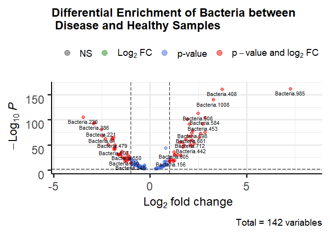

Differential Bacterial Enrichment
================
Team AR(r)OW
27/03/2022

``` r
train_data <- read.csv("training_data_proportional.csv", header = T, row.names = "X")
test_data <- read.csv("test_data_proportional.csv", header = T, row.names = "X")

#checking class balance
table(train_data$disease)
```

    ## 
    ## Disease-1 Disease-2 Disease-3   Healthy 
    ##      1559       463       970      2993

``` r
table(test_data$disease)
```

    ## 
    ## Disease-1 Disease-2 Disease-3   Healthy 
    ##       390       115       243       748

``` r
# CPM Normalization - train data

rownames(train_data) <- NULL

train_data_1 <- train_data %>% 
  select(-disease)

#CPM works on column (for sample wise normlaization) - so transposing the data
train_data_sample <- transpose(train_data_1, make.names = "sample_num")

train_data_sample_cpm <- cpm(train_data_sample) %>% data.frame() #CPM normlaization

train_data_sample_cpm <- train_data_sample_cpm %>%
  rownames_to_column("Bacteria") %>% 
  mutate(Bacteria = paste0("Bacteria-", Bacteria))

train_data_sample_cpm <- transpose(train_data_sample_cpm) #transposing it back

train_data_sample_cpm <- train_data_sample_cpm[-1,]

train_data_sample_cpm$sample_num <- colnames(train_data_sample) 

train_data_sample_cpm <- train_data_sample_cpm %>% 
  select(sample_num, everything()) %>% 
  left_join(select(train_data, disease, sample_num), by = "sample_num")

colnames(train_data_sample_cpm) <- colnames(train_data)

# write.csv(train_data_sample_cpm, "Samplenormalized_train_data.csv", quote = F)
```

``` r
#CPM Normalization - test data

rownames(test_data) <- NULL

test_data_1 <- test_data %>% 
  select(-disease)

test_data_sample <- transpose(test_data_1, make.names = "sample_num")

test_data_sample_cpm <- cpm(test_data_sample) %>% data.frame() #CPM normlaization

test_data_sample_cpm <- test_data_sample_cpm %>%
  rownames_to_column("Bacteria") %>% 
  mutate(Bacteria = paste0("Bacteria-", Bacteria))

test_data_sample_cpm <- transpose(test_data_sample_cpm)

test_data_sample_cpm <- test_data_sample_cpm[-1,]

test_data_sample_cpm$sample_num <- colnames(test_data_sample) 

test_data_sample_cpm <- test_data_sample_cpm %>% 
  select(sample_num, everything()) %>% 
  left_join(select(test_data, disease, sample_num), by = "sample_num")

colnames(test_data_sample_cpm) <- colnames(test_data)

# write.csv(test_data_sample_cpm, "Samplenormalized_test_data.csv", quote = F)
```

``` r
### Differential Bacteria in healthy vs disease - using edge R

train_data_deg <- train_data

metadata <- train_data_deg %>% 
  select(sample_num, disease) %>% 
  mutate(group = case_when(disease == "Healthy" ~ 0, TRUE ~ 1)) %>% 
  mutate(disease = factor(disease, levels = c("Healthy", "Disease-1", "Disease-2", "Disease-3"))) %>% 
  mutate(group = factor(group, levels = c(0,1)))

train_data_deg <- train_data %>% 
  select(-disease) %>% 
  transpose(make.names = "sample_num")

rownames(train_data_deg) <- colnames(train_data %>% select(-sample_num, -disease))  

dge_object <- DGEList(counts = train_data_deg, group = metadata$disease)

keep <-filterByExpr(dge_object)

dge_object <-dge_object[keep,,keep.lib.sizes=FALSE]
dge_object <-calcNormFactors(dge_object)

#EdgeE Pipeline
design <-model.matrix(~metadata$group)

y <-estimateDisp(dge_object,design)

fit <-glmQLFit(y,design)
qlf <-glmQLFTest(fit,coef="metadata$group1")

results <- topTags(qlf,n = Inf, p = 0.01) #Getting significant bacteria

#Plotting the Differential Enrichment
EnhancedVolcano(results$table, lab = rownames(results$table), x = "logFC", y = "FDR", pCutoff = 0.01, FCcutoff = 1, title =  "Differential Enrichment of Bacteria between \n Disease and Healthy Samples", subtitle = NULL)
```

    ## Warning: One or more p-values is 0. Converting to 10^-1 * current lowest non-
    ## zero p-value...

<!-- -->
